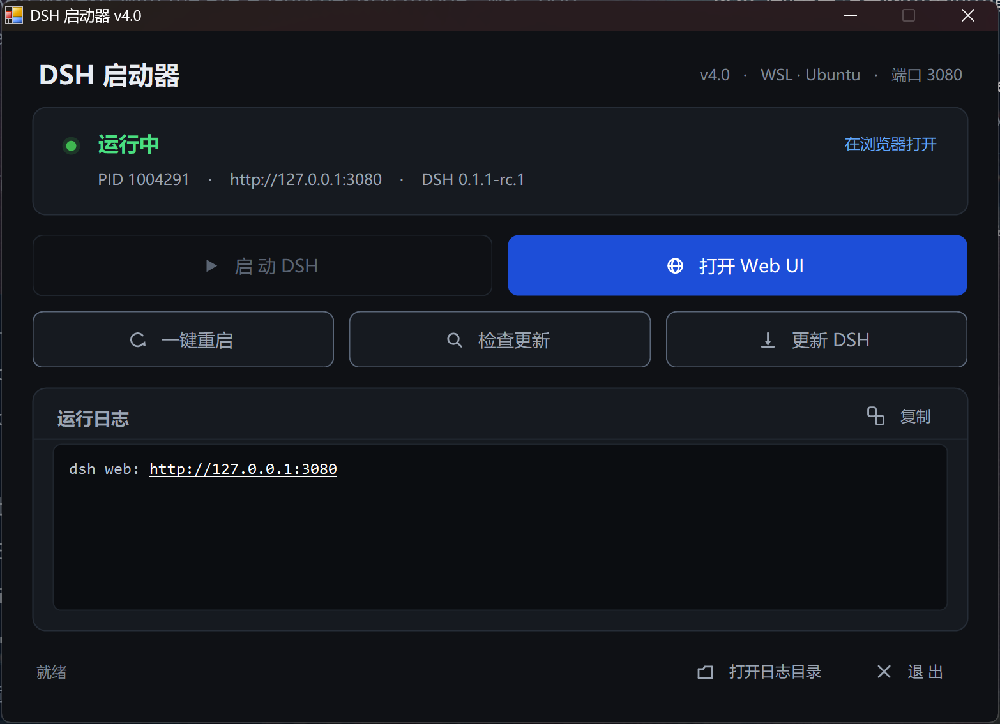

# DSH Launcher

[]()
[]()
[](LICENSE)

A small Windows tray-free desktop tool that manages the [DSH (DeepSeek Harness)](https://github.com/deepseek-ai/deepseek-harness) web server:
**start / restart / open Web UI / check for updates / update**, and it **works with both WSL2 and native Windows installs of DSH**.

> 中文说明: [README.md](README.md)
>
> ✅ Works with the latest DSH **0.1.2-rc.1**, including the new browser token auth (the launcher always opens the Web UI with the freshest token).



---

## Why it exists

Where DSH lives changes how you start it:

| Install location | Manual start |
|---|---|
| Inside WSL2 | open a WSL shell → `dsh web --no-open` → then type the URL in a browser |
| Native Windows | open PowerShell → `dsh web` → the process dies when you close that window |

Plus two everyday annoyances:

- After you close the browser tab, getting back in means starting the server again — even though it never stopped;
- When a new DSH version ships, you have to remember `npm i -g @deepseek-ai/dsh@latest`, and then restart the server.

This launcher puts all of that in one window: status at a glance, one click per action, and the same actions on the command line.

## Features

- **Auto-detects the runtime**: looks for `dsh` in a WSL distro first, then in the Windows global npm prefix. You can also pin it.
- **Start / restart** wait until the port actually answers (up to 120 s) before reporting success.
- **Open Web UI**: if the server is up, it just opens the browser (no restart); if it is down, it starts it first. This is the fix for "closed the tab, can't get back in".
- **Supports the DSH 0.1.2+ browser auth (token)**: starting with DSH 0.1.2, the Web UI requires a token. Before every open, the launcher re-reads the token URL printed in the latest server log — even if DSH was restarted outside the launcher — so you never hit "authentication required". After the first login the browser cookie lasts 30 days with token-free access.
- **Check / apply updates**: reads the installed version and queries npm for the latest, with full semver comparison (including `-rc.1` style prereleases); npm output streams into the log pane while updating.
- **Live status and logs**: port, PID, DSH version, update hint; log tail refreshes continuously, error lines are highlighted, one-click copy.
- **High-DPI and dark UI**: layout scales with the system DPI (text is no longer clipped on 200% displays); the palette is contrast-checked against WCAG 2.2 AA.
- **Full command line**: `--start` / `--stop` / `--restart` / `--open` / `--check-update` / `--update` / `--selftest` — easy to script or wire into Task Scheduler.
- **No external dependencies**: builds and runs with the .NET Framework 4.x that ships with Windows. No SDK, no runtime installer.

## Quick start

### 1. Requirements

- Windows 10 / 11 (x64)
- .NET Framework 4.x — already present on Windows
- DSH installed, either way:
  - **WSL2**: `npm i -g @deepseek-ai/dsh` inside a distro
  - **Native Windows**: install [Node.js](https://nodejs.org), then `npm i -g @deepseek-ai/dsh`

### 2. Build

```powershell
powershell -ExecutionPolicy Bypass -File build.ps1
```

The result is `dist\DSH-Launcher.exe`. Double-click it, or make a desktop shortcut.

Developing from WSL? Use the helper that drives the Windows `csc.exe`:

```bash
./build.sh          # output lands in dist/ as well
```

### 3. Configuration (optional)

Copy `launcher.example.json` to `launcher.json` next to the exe:

```json
{
  "mode": "auto",
  "port": 3080,
  "wslDistro": "",
  "wslStartScript": "",
  "dshHome": ""
}
```

| Key | Default | Meaning |
|---|---|---|
| `mode` | `auto` | `auto` detect / `wsl` force WSL / `windows` force native |
| `port` | `3080` | DSH web UI port |
| `wslDistro` | empty | WSL distro name; empty picks the first one with `dsh` |
| `wslStartScript` | empty | absolute path to your own WSL start script |
| `dshHome` | empty | value for `DSH_HOME`; empty uses the platform default |

Environment variables override the file:

| Variable | Effect |
|---|---|
| `DSH_LAUNCHER_MODE` | `auto` / `wsl` / `windows` |
| `DSH_PORT` | port |
| `DSH_WSL_DISTRO` | WSL distro |
| `DSH_WSL_START` | WSL start script |
| `DSH_HOME` | DSH home directory |

## How it works

The launcher never runs DSH itself — it is a remote control. Status comes from a TCP probe; actions come from platform commands.

| Action | WSL mode | Native Windows mode |
|---|---|---|
| Status | connect `127.0.0.1:<port>` (WSL2 localhost forwarding) | connect `127.0.0.1:<port>` |
| Start | `wsl.exe -d <distro> -- bash -c "<built-in script>"`; the script clears proxies, fixes `PATH`, then `exec dsh web --no-open --port N > ~/.dsh-web.log` | `node <npm root -g>\@deepseek-ai\dsh\lib\bin.js web --no-open --port N`, output redirected to `logs\dsh-web.log` |
| Stop | `pkill -f '[d]sh web'` | `taskkill /PID <pid> /T /F` |
| PID | `ss -tlnp` | `netstat -ano` |
| Log | `tail -n 200 ~/.dsh-web.log` (sentinel line proves the call succeeded) | reads `logs\dsh-web.log` directly |
| Version | `npm root -g` + read `package.json` | same |
| Update | `npm install -g @deepseek-ai/dsh@latest` | same |

**Why the WSL script is base64-encoded**: a `wsl.exe` command line passes through two layers of quote parsing (Windows and Linux). Encoding the bash script and piping it in removes that problem entirely.

**Why proxies are unset before start**: a dead `http_proxy` makes DSH's API calls hang forever; unsetting those variables first avoids it.

## Command line

```
DSH-Launcher.exe [option]

  (none)            open the GUI
  --probe           write status JSON to logs\selftest.json
  --detect          print the detected runtime and exit
  --start           start DSH (wait up to 120 s for the port)
  --stop            stop DSH
  --restart         stop, then start
  --open            open the Web UI (starts DSH first if needed)
  --check-update    check whether a newer version exists
  --update          update to the latest (stops the server first)
  --selftest        full self-test (start / restart / open / check / failure injection)
  -h, --help        help
```

`--probe` and `--check-update` emit JSON so scripts can consume them:

```json
{"action":"probe","env":"WSL · Ubuntu","port":3080,"running":true,"url":"http://127.0.0.1:3080","openUrl":"http://127.0.0.1:3080","pid":1004291}
{"action":"check-update","env":"WSL · Ubuntu","installed":"0.1.1-rc.1","latest":"0.1.2-rc.1","state":1,"update":true,"error":""}
```

## FAQ

**The UI says "DSH 未就绪"**
Install DSH as shown: `npm i -g @deepseek-ai/dsh` (inside WSL or on Windows). The "更新 DSH" button also installs it if missing.

**`dsh` is installed in WSL but not detected**
The built-in script starts DSH through `bash -lc`, which loads your login profile. Some version managers still hide the binary; in that case set `wslDistro` explicitly, or point `wslStartScript` at your own script.

**Port 3080 is taken**
Change `port` in `launcher.json` (for example `3081`). The launcher passes it to DSH via `--port`.

**I want WSL and native Windows instances at the same time**
Keep two copies of the exe with different `launcher.json` ports.

**Does "退出" stop DSH?**
No. Closing the window leaves DSH running; open the launcher again and press "打开 Web UI".

**Closing the launcher kills the native Windows DSH?**
It does not. The native backend starts DSH through `cmd.exe` with file redirection, so the child is independent of the launcher process.

## Project layout

```
src/
  Program.cs     entry: CLI modes, start/stop/update orchestration, self-test
  Config.cs      launcher.json + environment variable resolution
  Backends.cs    IBackend / WslBackend / WindowsBackend / auto-detection
  Ui.cs          design tokens, vector icons, buttons, status indicator
  MainForm.cs    main window
build.ps1        one-command build (Windows)
build.sh         build from WSL through the Windows csc.exe
app.manifest     DPI awareness + execution level
icon/            application icon
```

## Development

```bash
# build
./build.sh                                            # WSL
powershell -ExecutionPolicy Bypass -File build.ps1    # Windows

# inspect the detected runtime (starts nothing)
dist/DSH-Launcher.exe --detect

# full self-test: start -> restart -> open -> check update -> failure injection
dist/DSH-Launcher.exe --selftest
```

After UI changes, set `DSH_SMOKE=1` before launching: the window moves off-screen, and after 2.5 s it writes every control's position and size to `logs\ui-dump.json` and exits — handy for scripted layout checks.

## License

[MIT](LICENSE)

DSH (DeepSeek Harness) is a DeepSeek project. This is an independent third-party launcher and is not affiliated with DeepSeek.
