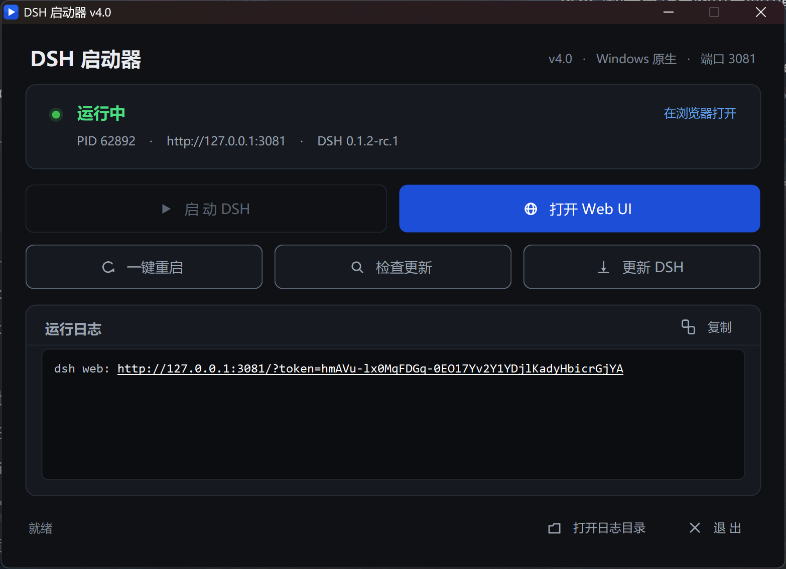

# DSH 启动器

[]()
[]()
[](LICENSE)

一个 Windows 桌面小工具，用来管理 [DSH（DeepSeek Harness）](https://github.com/deepseek-ai/deepseek-harness) 的 Web 服务：
**一键启动 / 重启 / 打开 Web UI / 检查更新 / 更新**，并且**自动适配 WSL2 与 Windows 原生两种运行环境**。

> English: [README.en.md](README.en.md)


---

## 它解决什么问题

DSH 装在哪里，启动方式就完全不同：

| 安装方式 | 手动启动要做什么 |
|---|---|
| WSL2 里 | 开一个 WSL 终端 → `dsh web --no-open` → 再去浏览器敲地址 |
| Windows 原生 | 开一个 PowerShell → `dsh web` → 进程挂在窗口上，关掉窗口就没了 |

而且常见的两个坑：

- 浏览器关掉之后想再进去，得回终端重新启动一次（其实服务还在跑，只是没人打开页面）；
- DSH 有新版本时，要自己记着 `npm i -g @deepseek-ai/dsh@latest`，更新完还得重启服务。

这个启动器把这些动作收进一个窗口：状态一眼可见，常用操作一个按钮，命令行也能调。

## 特性

- **自动探测运行环境**：先看 WSL 发行版里有没有 `dsh`，再看 Windows 全局包；也可以手动指定。
- **一键启动 / 一键重启**：等待端口真正就绪（最多 120 秒）再报成功，不是"命令发出去了"就算完。
- **打开 Web UI**：服务在跑就直接开浏览器（不重启）；没跑就先启动再打开 —— 专门解决"关掉浏览器进不去"的问题。
- **检查更新 / 更新 DSH**：读本地已装版本 + 联网查 npm 最新版，做完整语义化版本比较（含 `-rc.1` 这类预发布号）；更新时 npm 输出实时流式打进日志框。
- **实时状态与日志**：端口、进程 PID、DSH 版本、可更新提示；日志尾部实时刷新，报错行自动标红，一键复制。
- **高 DPI 与深色界面**：按系统 DPI 缩放（200% 屏上文字不再被切掉），界面配色经过 WCAG 2.2 AA 对比度校验。
- **全功能命令行**：`--start` / `--stop` / `--restart` / `--open` / `--check-update` / `--update` / `--selftest`，方便写进脚本或计划任务。
- **无外部依赖**：只用 .NET Framework 4.x 自带的东西编译运行，不需要装 SDK、不需要运行时安装包。

## 快速开始

### 1. 前置条件

- Windows 10 / 11（x64）
- .NET Framework 4.x —— 系统自带，无需安装
- 已经装好 DSH，二选一：
  - **WSL2**：在发行版里 `npm i -g @deepseek-ai/dsh`
  - **Windows 原生**：装好 [Node.js](https://nodejs.org) 后 `npm i -g @deepseek-ai/dsh`

### 2. 构建

```powershell
powershell -ExecutionPolicy Bypass -File build.ps1
```

产物在 `dist\DSH-Launcher.exe`，双击就能用（可以右键发送到桌面快捷方式）。

在 WSL 里开发的话可以用：

```bash
./build.sh          # 调用 Windows 侧的 csc.exe 编译，产物同样落在 dist/
```

### 3. 配置（可选）

把 `launcher.example.json` 复制成 `launcher.json` 放在 exe 同目录：

```json
{
  "mode": "auto",
  "port": 3080,
  "wslDistro": "",
  "wslStartScript": "",
  "dshHome": ""
}
```

| 字段 | 默认 | 说明 |
|---|---|---|
| `mode` | `auto` | `auto` 自动探测 / `wsl` 强制 WSL / `windows` 强制 Windows 原生 |
| `port` | `3080` | DSH Web UI 监听端口 |
| `wslDistro` | 空 | WSL 发行版名；留空自动取第一个装有 dsh 的 |
| `wslStartScript` | 空 | 自定义 WSL 启动脚本的绝对路径；留空用内置脚本 |
| `dshHome` | 空 | 对应 `DSH_HOME`；留空用平台默认 |

环境变量优先级高于配置文件：

| 环境变量 | 作用 |
|---|---|
| `DSH_LAUNCHER_MODE` | `auto` / `wsl` / `windows` |
| `DSH_PORT` | 覆盖端口 |
| `DSH_WSL_DISTRO` | 覆盖 WSL 发行版 |
| `DSH_WSL_START` | 覆盖 WSL 启动脚本 |
| `DSH_HOME` | 覆盖 DSH_HOME |

## 工作原理

启动器本身不跑 DSH，它只是**遥控**：状态靠 TCP 探测端口，动作靠调用对应平台的命令。

| 动作 | WSL 模式 | Windows 原生模式 |
|---|---|---|
| 状态判断 | 连 `127.0.0.1:<port>`（WSL2 的 localhost 转发） | 连 `127.0.0.1:<port>` |
| 启动 | `wsl.exe -d <发行版> -- bash -c "<内置脚本>"`，脚本里清代理、补 PATH、`exec dsh web --no-open --port N > ~/.dsh-web.log` | `node <npm root -g>\@deepseek-ai\dsh\lib\bin.js web --no-open --port N`，输出重定向到 `logs\dsh-web.log` |
| 停止 | `pkill -f '[d]sh web'` | `taskkill /PID <pid> /T /F` |
| 取 PID | `ss -tlnp` | `netstat -ano` |
| 读日志 | `tail -n 200 ~/.dsh-web.log`（用哨兵行判断调用是否成功） | 直接读 `logs\dsh-web.log` |
| 读版本 | `npm root -g` + 读 `package.json` | 同左 |
| 更新 | `npm install -g @deepseek-ai/dsh@latest` | 同左 |

**为什么 WSL 侧用 base64 传脚本**：`wsl.exe` 的命令行要经过 Windows 与 Linux 两层引号解析，多层嵌套极易出错；把 bash 脚本 base64 编码后管道进去，引号问题彻底消失。

**为什么启动脚本里要清代理**：如果系统里配置了已失效的 `http_proxy`，DSH 的 API 请求会一直挂着不返回；启动前 unset 掉这些变量可以避免。

## 命令行

```
DSH-Launcher.exe [选项]

  (无参数)          打开图形界面
  --probe           输出状态 JSON 到 logs\selftest.json
  --detect          打印探测到的运行环境并退出
  --start           启动 DSH（等待端口就绪，最多 120 秒）
  --stop            停止 DSH
  --restart         停止后重新启动
  --open            打开 Web UI（未运行则先启动）
  --check-update    检查是否有新版本
  --update          更新到最新版（会先停止服务）
  --selftest        全量自测（启动 / 重启 / 打开 / 检查更新 / 失败注入）
  -h, --help        显示帮助
```

`--probe` 与 `--check-update` 的结果是 JSON，方便脚本消费：

```json
{"action":"probe","env":"WSL · Ubuntu","port":3080,"running":true,"url":"http://127.0.0.1:3080","pid":1004291}
{"action":"check-update","env":"WSL · Ubuntu","installed":"0.1.1-rc.1","latest":"0.1.2-rc.1","state":1,"update":true,"error":""}
```

## 常见问题

**界面显示「DSH 未就绪」**
按提示装 DSH：WSL 里 `npm i -g @deepseek-ai/dsh`，或 Windows 里装好 Node.js 后执行同样命令。点「检查更新」/「更新 DSH」也能顺手把它装上。

**WSL 里明明装了 dsh，却探测不到**
内置脚本用 `bash -lc` 启动（会加载登录 profile），如果你用的是 nvm 之类的版本管理器，个别配置可能不生效。这时把 `wslDistro` 写清楚，或者用 `wslStartScript` 指向你自己的启动脚本。

**3080 端口被占用**
`launcher.json` 里把 `port` 改成别的，比如 `3081`。注意 DSH 自身也要用同一个端口（启动器会通过 `--port` 传给它）。

**想同时跑 WSL 和 Windows 两个实例**
各放一份 exe，分别写 `launcher.json` 指定不同 `port` 即可。

**点「退出」会停掉 DSH 吗？**
不会。退出只是关窗口，DSH 继续在后台跑 —— 下次打开点「打开 Web UI」就能直接进。

## 界面

| WSL 模式 | Windows 原生模式 |
|---|---|
|  |  |

## 项目结构

```
src/
  Program.cs     入口：CLI 模式、启动/停止/更新编排、自测
  Config.cs      launcher.json + 环境变量解析
  Backends.cs    后端抽象：IBackend / WslBackend / WindowsBackend / 自动探测
  Ui.cs          设计令牌、矢量图标、按钮与状态指示器
  MainForm.cs    主窗口
build.ps1        Windows 一键构建
build.sh         WSL 里构建（调用 Windows 侧 csc）
app.manifest     DPI 感知 + 执行级别清单
icon/            应用图标
```

## 开发

```bash
# 构建
./build.sh                                   # WSL
powershell -ExecutionPolicy Bypass -File build.ps1   # Windows

# 探测当前环境（不启动任何东西）
dist/DSH-Launcher.exe --detect

# 全量自测：启动 → 重启 → 打开 → 检查更新 → 失败注入
dist/DSH-Launcher.exe --selftest
```

界面改动后可以用 `--selftest` 的姊妹钩子做无头校验：设置环境变量 `DSH_SMOKE=1` 启动，窗口会移出屏幕、2.5 秒后把全部控件的坐标尺寸写进 `logs\ui-dump.json` 再自动退出，方便脚本检查布局有没有越界或重叠。

## 许可

[MIT](LICENSE)

DSH（DeepSeek Harness）是 DeepSeek 的项目，本项目只是它的一个第三方启动器，与 DeepSeek 官方无关。
